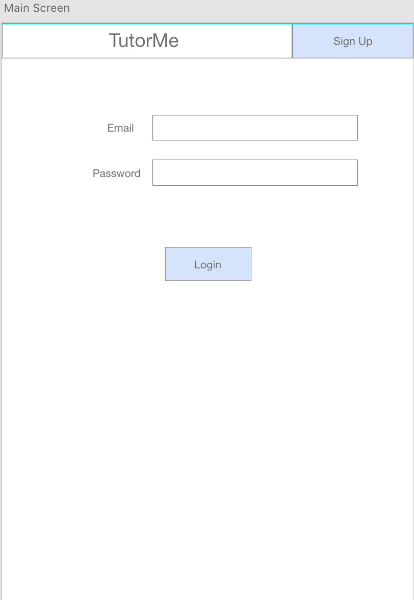
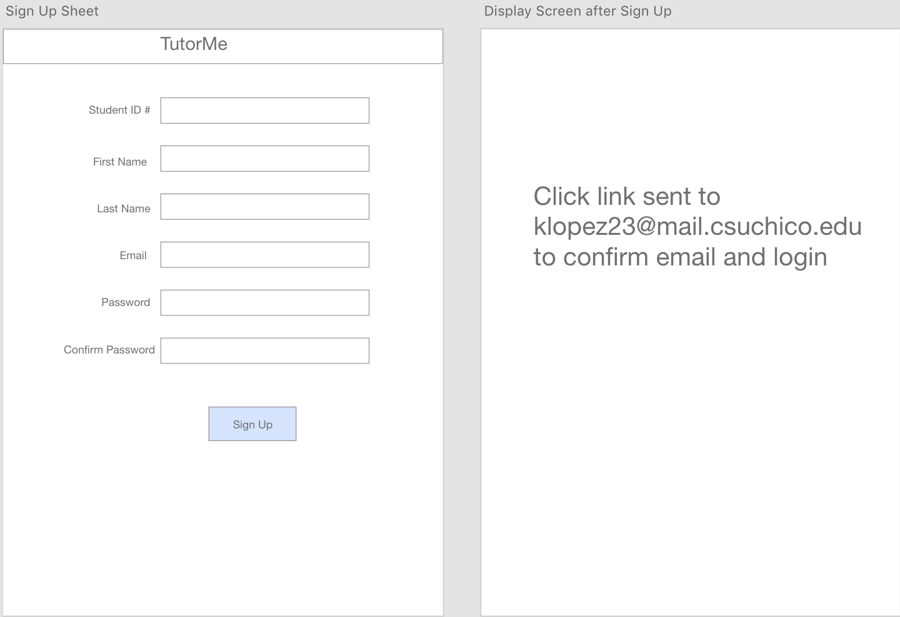
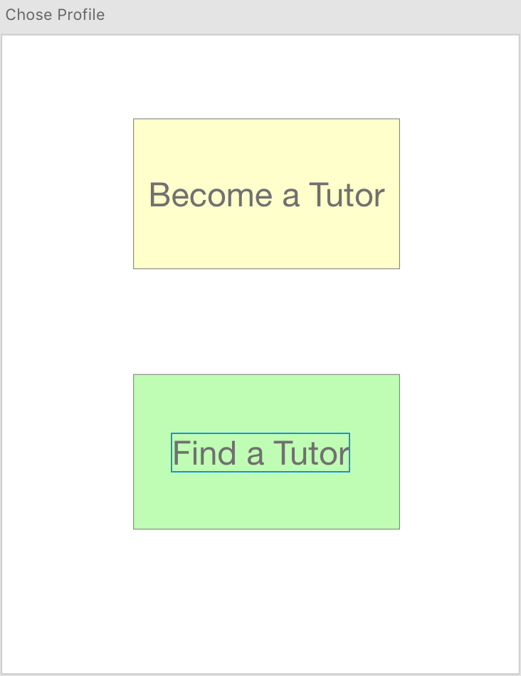
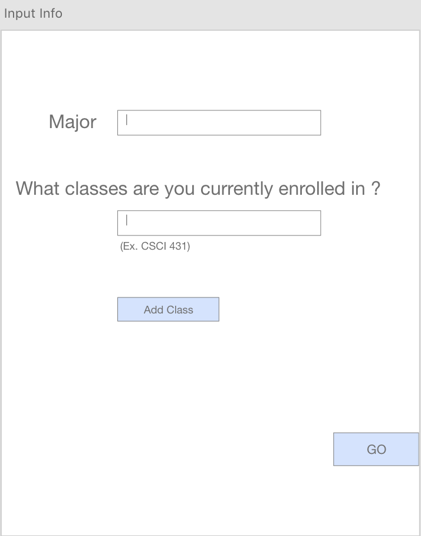
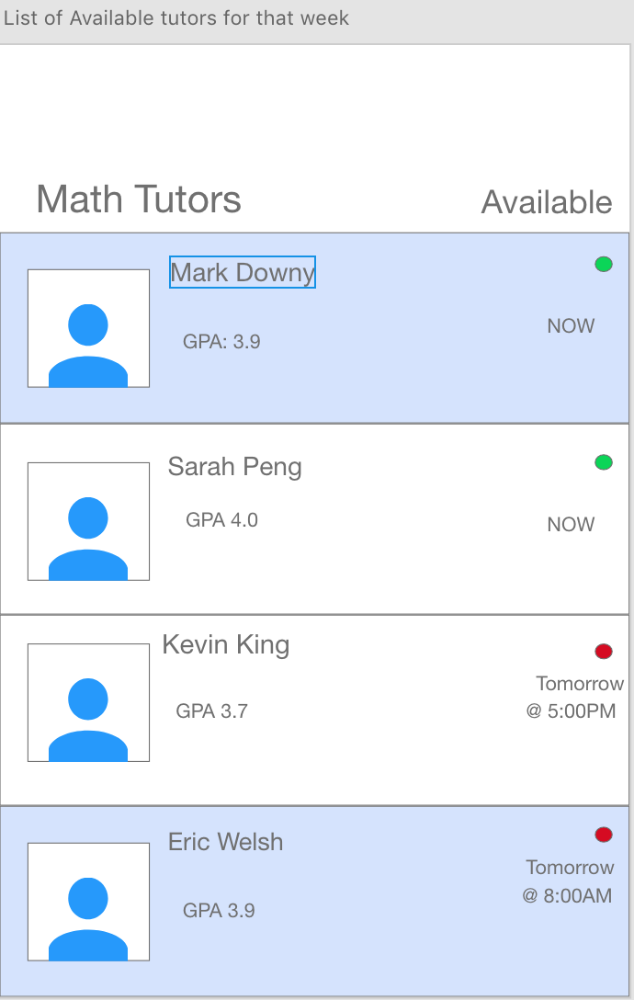
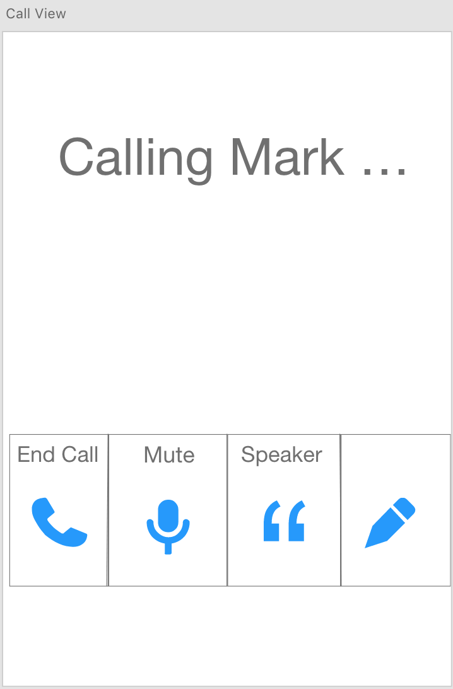
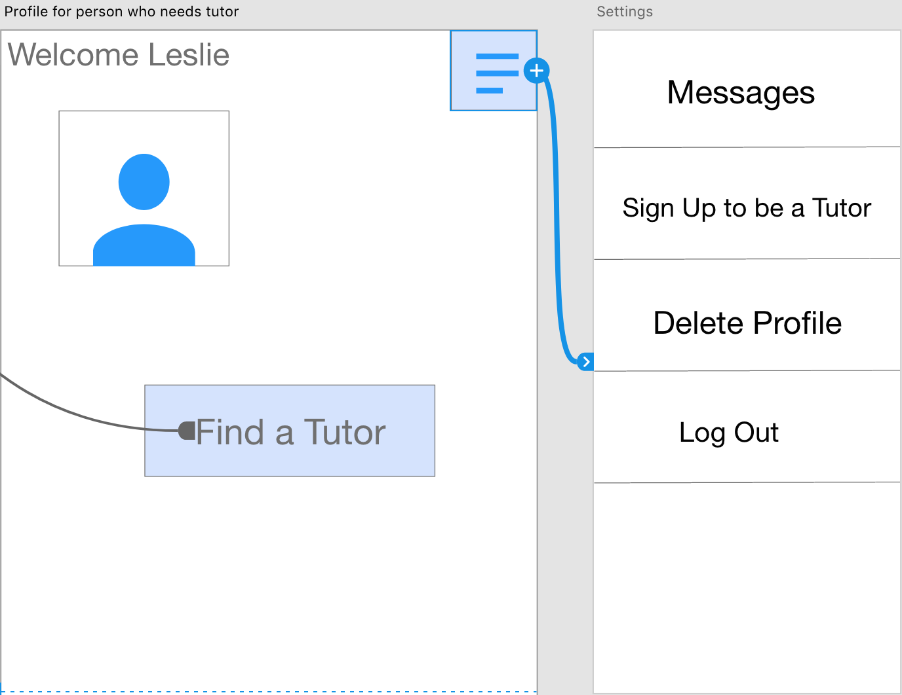
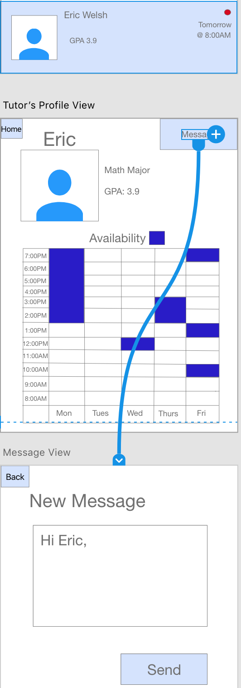
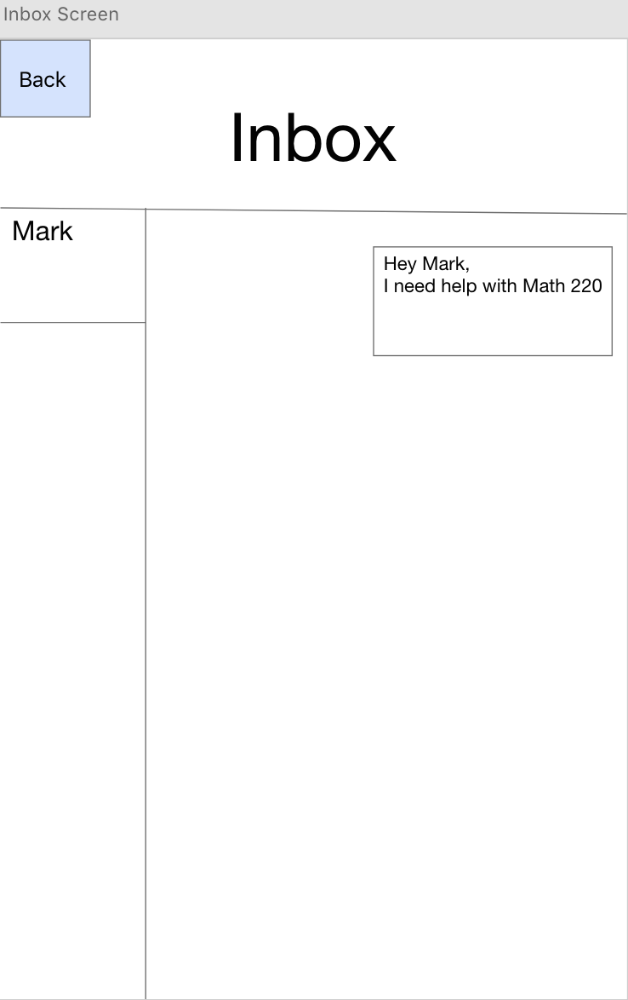
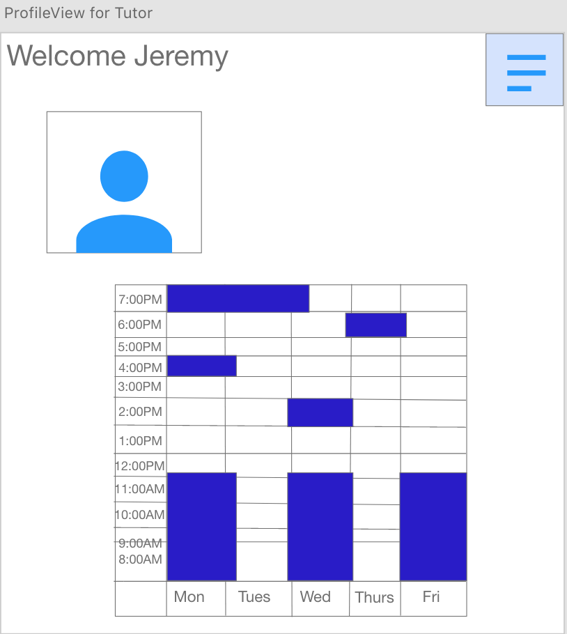

# TutorMe
## Interaction Design

**Jozzel Esqueda**

*Protoype Link*: 
https://xd.adobe.com/view/ff99c1af-2d67-4a75-4ae4-985a8feada83-89a8/

## Phase II: User-Centered Design
**Screen Views for Tutoree:**

- When opening TutorMe from your smart phone, the main screen will ask for your login credentials. You have 2 options: 

1) You can login
2) Or you can Sign Up

For the sake of new users, let's sign up!
  

- Once you input your information, you will receive an email from TutorMe, and upon clicking on the link,it will redirect you back to the login screen.
After logging in:

- Users have 2 options:

1) Become a Tutor
2) Find a Tutor

Let's find a tutor!

- In this step, we want to add all the classes enrolled for the semester. 
This feature was added based on our user data suggestion responses.
 

 
- Based on what classes you added, you can pick which class you need a tutor for.
Let's say you need help with MATH:

- After clicking on the class you need help with, a list of tutors who have previously taken that exact same class will appear.

Let's say you need to get a hold of a tutor ASAP like Persona "Trey".
Let's click on the first tutor who is available NOW !

- By clicking the tutors who are available NOW, TutorMe will automatically start calling the tutor.
This feature allows users a quick and effecient way to contacting someone to help you 
because you don't waste time

1) Trying to get a hold of a tutor
2) And setting up a time and place to meet.

- Once the call ends, your profile/account will show.
The three lines on the upper right corner are all the options you have.

If instead of picking a tutor who is available NOW, 
you wanted to meet with a tutor the next day right before an exam/quiz,
You can do that also:

 

- As you're scrolling through the list of tutors, you find a tutor who is available the next morning.
Once clicking on the tutor, his profile will appear.
On the upper right corner, you have the option to message him.
After clicking the message button, you will be able write them a message.

- To check your messages, you would click the button with the 3 lines on the upper right corner, click messages, and your inbox will show.

**Screen Views for Tutor:**

- Let's say you wanted to sign up to be a tutor:
Click on the *Become a Tutor* button.

- Once filling out all your info and availabilty to tutor, you will be redirected to yout profile/account.

- Profile screen displays your availabilty chart and profile pic.
Now you are all set up to become a tutor, people will start calling or messaging you based on their needs.

