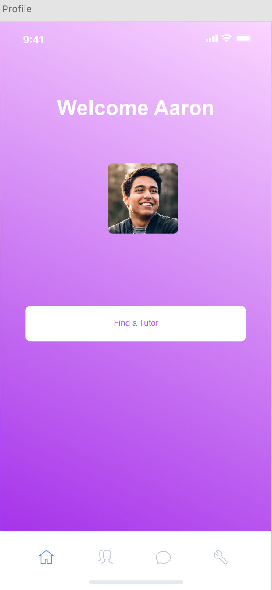
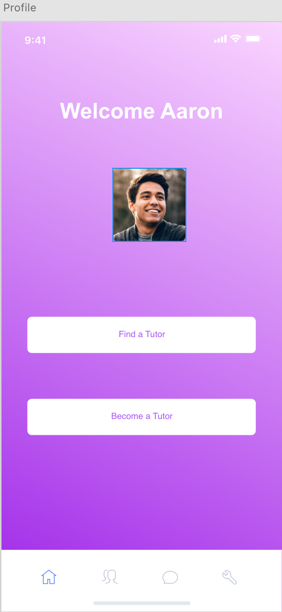

# TutorMe
## Phase 3: Usability Evaluation

**Jozzel Esqueda**

*Prototype Link*:
https://xd.adobe.com/view/ff99c1af-2d67-4a75-4ae4-985a8feada83-89a8/

[Protocol Link](Protocol.pdf/)

## Phase III: User Testing Evaluation

**Task Analysis**

- Task 1 answers the quesion "Is the user able to connect with a tutor in a timely manner and
how difficult is it to do so?"

In this task we hope to discover two things:

1) How quickly someone can find a tutor for a specific class and
2) How easy or difficult the app is to manage under a time constraint. 

- Task 2 answers the question "How easy or hard is it to sign up to be a tutor?"

In this task we hope to disover if the app is too complicated for someone who wants to be a 
tutor after signing up for finding a tutor.

**User Testing Methods**

This usability test was a mix of both summative and formative testing while incorporating
"think-aloud" and experimental techniques during the usability test.

1) Before the user test, it was very clear that the user had minor trouble in signing up 
to become a tutor for **Task 2** due to the home screen and button layout.

2) After the usability test, the process of becoming a tutor was facilitated by adding one
button to the home screen.

 

